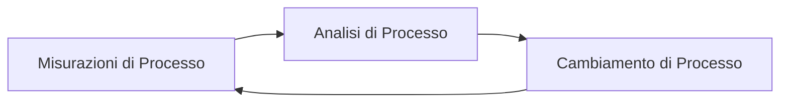
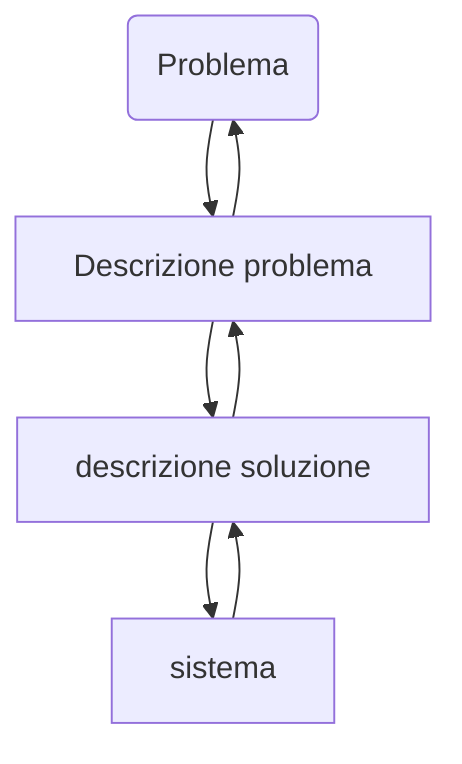
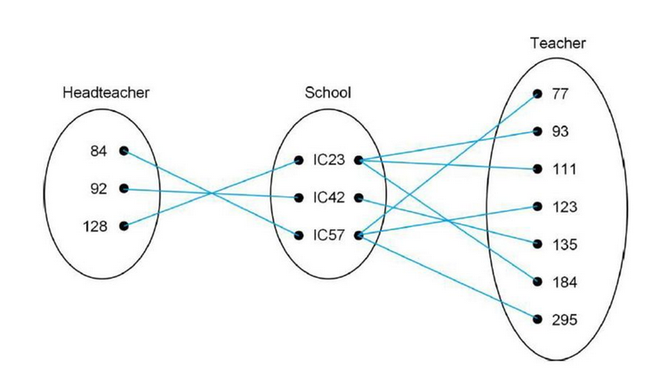

# Ingegneria del software 2

[TOC]

## 18/09/2019

### Software

#### Cosa è un software

> Definizione:

#### Cos'è un software di Qualità

Un software di qualità ha:

1. **Mantenibile**: Modificabile con facilità;
2. **Affidabile**: Fa quello che deve fare senza bug;
3. **Utilizzabile**: Intuitività, _user-friendly_.

#### Ingegneria del software

> **Ingegneria del software**: Disciplina ingegneristica che si occupa di **tutti gli aspetti** della **produzione** del software.

Non si basa solo sul processo tecnico di sviluppo, anche la gestione del progetto e lo sviluppo di tools a supporto della produzione software.	

> **Disciplina Ingegneristica**: Utilizzare teoria e metodi appropriati per risolvere problemi tenendo conto dei vincoli **organizzativi** e **finanziari**.

#### Costo del software

I costi del software **dominano** i costi dei sistemi informatici:

* Costi di debugging;
* Costi di testing;
* Costi di mantenimento team;
* Costi di manutenzione software.

#### Quando un software fallisce

1. All'aumento della complessità di sistema, il software **potrebbe fallire.**

   Le esigenze cambiano, bisogna costruire sistemi più grandi e più complessi, con nuove capacità.

2. Mancato utilizzo di sistemi di **Ingegneria del Software**

   È facile scrivere software, ma scriverlo rispettando i principi precedenti(**mantenibile, affidabile, utilizzabile**) non è immediato.

### Ingegneria del Software vs Ingegneria dei Sistemi

| Ingegneria del Software        | Ingengeria del Sistemi                                       |
| ------------------------------ | ------------------------------------------------------------ |
| Non si preoccupa dell'Hardware | Si  preoccupa di tutti gli ambiti, compreso HW e Processo oltre a SW. |

>  L'ingegneria del Software è dunque un **ramo dell'Ingegneria dei Sistemi**.

#### Attività fondamentali

1. **Software specification** (Analisi dei requisiti);
2. **Sviluppo Software**;
3. **Validazione Software**(_Abbiamo coperto tutti i requisiti?_);
4. **Evoluzione Software**: Il software viene modificato per riflettere le mutabili esigenze dei clienti del mercato.

Cosa dobbiamo cambiare con il tempo per mantenere il software?

L'ingegneria del software deve affrontare:

* Crescente diversità;
* Rischiesta dei tempi di consegna ridotti;
* Sviluppo di software affidabili(ovviamente).

#### Prodotti software

1. **Generali**

   Prodotti creati generalmente che funzionano più ampiamente e meno specificatamente.

2. **Su misura**

   Prodotto creato su misura per l'azienda stessa, generalmente più costosa.

> La **specification** e **Evolution** dipendono dal tipo del prodotto! Se generale è più difficile che avvenga una modifica per un sistema singolo.

##### Qual è il metodo corretto?

Dipende ovviamente dal tipo di software che dobbiamo sviluppare. 

> Tutti i progetti software devono essere gestiti **in modo professionale!** 

### Principi Generali

1. I sistemi dovrebbero essere sviluppati utilizzando un **processo di sviluppo gestibile e comprensibile**, utilizzando processi diversi per software diversi;
2. **Affidabilità e efficienza** sono importanti per tutti i tipi di sistema;
3. **Comprensione e gestione di specification e dei requisti software** sono molto importanti;
4. **Riutilizzo del software** più che scriverne uno nuovo.

### Ingengeria del software e L'internet

* I servizi Web, chiamati **web services**, permette di accedere a dei servizi e funzionalità di altre applicazioni attraverso il Web.
* Utilizzo di **Cloud computing**, cioè il pagare il servizio in base all'utilizzo, hostato sul *cloud*.

Abbiamo dunque anche lo **sviluppo Web**:

* Disponibilità di servizi software, avendo una architettura distribuita .
* All'utilizzatore non importa dove è il sistema, utilizza una interfaccia apposita che crea **astrazione**.
* Ha portato ad importanti progressi nei linguaggi di programmazione con forte riutilizzo del software.

> **SDN**: Software Defined Network

Sono chiamati **sistemi distribuiti complessi**.

I sistemi web hanno dei requisiti:

1. Il riuso del software è l'approccio dominante.
2. Sviluppo e consegna in modo **incrementale**.
3. Sviluppo di **interfaccia grafica-GUI** molto importante. 

## 19/09/2019

Descrizione minima di un processo: Quando di solito diescriviamo un processo parliamo di attività, […]

le descrizioni dei processi includono input (attività), outputs (prodotti), ruoli (responsabilità delle persone coinvolte), pre e pos-condizioni delle attività

Ad esempio considerando l'attività fare la spesa, i soldi sono input, i prodotti acquistati sono gli output, il ruolo tuo è di fare la spesa, precondizione avere soldi, dispensa vuota, postcondizione dispensa piena

Se dettagliamo un attività in più sub-attivita1 diventa un processo

Modello di processo: una descrizione semplificata del processo, osservato da un determinato punto di vista (cit. Giorgini)

[Esempio di bpmn]

### Processo del software

Il processo del sofware è un insieme strutturato di attività necessarie per sviluppare un sistema sofware
Modello di processo soware è una rappresentazione astratta di un processo. 

2 scuole di pensiero, plan-driven or agile
Plan-driven process:  sono processi in cui tutte le attivita1 di processo sono pianificate in anticipo e i progressi sono misurati rispetto a questo piano.

Agile driven process: la pianificazione è parziale e incrementale per adattarsi alle necessità dei clienti

Waterfall

Primo sviluppo incrementale: spirale

Problemi dello sviluppo incrementale: Il processo non è visibile la struttura del sistema tende a degradarsi con l'aggiunta di nuovi incrementi

Riuso del software, applicazioni standalone (COTS) che sono configurate per l'uso in un ambiente particolare, collezioni di software objects (pacchetti da integrare con un framework di componenti) e i servizi web che sono sviluppati secondo gli standard di servizio e che sono disponibili per l'invocazione remota

Vantaggi del riuso:

riduzione dei costi e rischi, consegna e implementazione del sistema più rapida.

Svantaggi: I compromessi sono inevitabili si perde il controllo sui componenti esterni utilizzati

### Ingegneria dei requisiti 

È il processo per stabilire quali servizi sono necessari

Processo ingeneristico :

* cattura e analisi requisiti 
* specifiche requisiti 
* valutazione requisiti 

### Progettazione e implementazione del software

Progetta una struttura sofware che realizzi la specification, poi si traduce la struttura in codice

Analogia matematica: abbiamo una funzione $$f$$ che mappa le specifiche alla implementazione, però abbiamo la limitazione della tecnologia quindi non tutti i punti del dominio vengono mappati.

Implementazione:

Il software viene implementato sia sviluppando uno o piu programmi sia configurando un sistema. La programmazione è un attività individuale senza processo standard.

Validazione e verificazione devono vedere se le specifiche sono state implementate correttamente e i clienti sono soddisfatti.

È importante fare il testing dei componenti, ma anche il system testing perchè non è detto che i componenti che funzionano da soli funzionino bene insieme.

Non solo nello sviluppo si deve fare testing (vedere slide per esempio)

### Evoluzione del processo: 

## 25/09/2019

### Conceptual Modelling

> **Conceptual Modelling:** Ottenimento dei requisiti del software

Abbiamo diversi modelli. Ma che cos'è un modello:

> **Modello**: Modo di **rappresentare**, **comunicare** e **documentare** soluzioni computazionali.

Abbiamo diversi livelli per ogni modello.

### Tecniche

#### ER

* Diagramma **E-R: Entity Relationship**;

  * Paradigma strutturato

    * *Entity*
      * Insieme di oggetti del reale e gestita dal sistema.
      * Possono essere **concreti** o **astratti**.
    * *Relationship*
    * *Attribute*
    * *Generalization/specialization*
    * *Associative Entity*

  * Diagramma delle occorrenze: Tiene le istanze di ogni entità.

    

  * Strutturato:

    * Modello **input-processing-output**.
    * I **dati** e le **funzioni** sono separati.

#### UML

* Unified Modelling Language(**UML**).
  * Paradigma Object-Oriented:
    * Modello ad **oggetti**;
    * Gli oggetti combinano **dati e funzioni**;
    * I **concetti** del problema sono modellati come **oggetti**, che sono associati e **interagiscono** tra loro.

Nello sviluppo strutturato il **gap semantico è maggiore**, sono dunque difficili da mantenere:

* Le funzioni devono conoscere la struttura dei dati
* Le modifiche nella struttura dei dati risultano in cambiamenti delle funzioni correlate.

UML va a sostituirlo:

* Miglioramento di **interazione tra analisti e specialisti**
* Supporto per **riuso e la leggibilità**
* Uso del "mondo ad oggetti".

##### Astrazione

> **Modelli mentali:** Ho una visione più semplice del mondo, ignoro gli aspetti irrilevanti creando **astrazione.**

##### Incapsulamento

L'incapsulamento ci permette di separare **aspetti esterni** (cosa fa) dagli aspetti **interni** (come fa):

* Aspetti **esterni**: **interfaccia, contratto**;
* Aspetti **interni**: **Implementazione**.

##### Modularità

Divido il sistema in moduli:

* **Coesivi**
* **Autonomi**
* **Semplici e coerenti.**

> Fondamentale per **riuso del software.**

##### Gerarchia

Divisione degli oggetti in gerarchia(l'extends praticamente)

I più alti sono più generici.

Strutturo meglio il **modello e semplifico la comprensione** del problema.

**Sinergia** per gestire complessità:

* *Astrazione che aiuta a identificare concetti rilevanti*
* *Incapsulamento nasconde la vista interna*
* *Modularità permette riuso e raggruppamento*
* *Le astrazioni compongono le gerarchie.*

##### Classi e oggetti

> Una classe è un insieme di oggetti con le stesse proprietà, lo stesso comportamento e stesse relazioni con oggetti(con stessa semantica).

Gli oggetti sono **istanze** delle classi.

Uso di attributi privati e uso di getter e setter;

(prosegue con ING.SW 1), guarda slide

Annoto solo ciò che non è stato fatto a IS1

* `{complete}`  tutti i risultati
* `{disjoint,complete}` tutti i risultati e unici(non prendo in join)

**part-whole**: Aggregazione e composizione(una ruota è parte di una macchina) (uso del diamante)

* Diamante vuoto: Aggregazione
* Diamante pieno: Composizione

(quello che abbiamo fatto con JAVA ronchetti, part-of)

